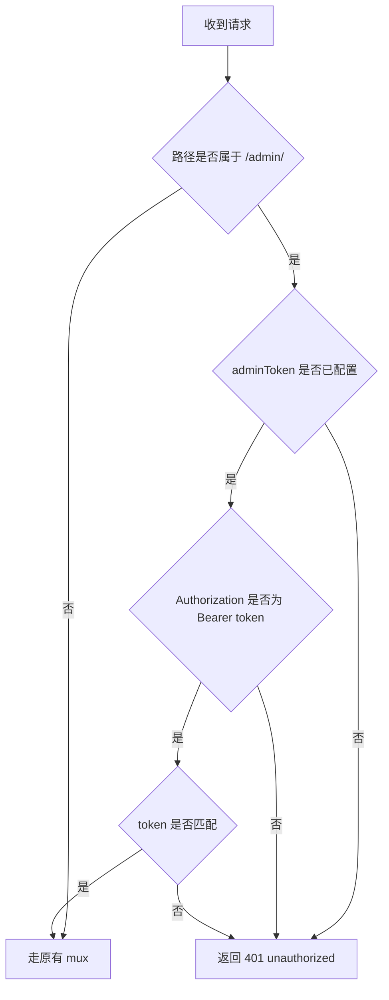

# 管理接口最小固定 Token 鉴权设计文档

日期：2026-03-24

## 1. 背景

当前系统已经具备：

- [`internal/httpserver/admin_handler.go`](internal/httpserver/admin_handler.go) 的管理接口集合
  - `POST /admin/inheritance-drafts`
  - `POST /admin/releases`
  - `POST /admin/promotions`
  - `GET /admin/config-versions/{versionID}`
  - `GET /admin/audit-events`
  - `GET /admin/runtime-events`
- [`internal/controlplane/service.go`](internal/controlplane/service.go) 的最小控制面闭环
- [`internal/audit/recorder.go`](internal/audit/recorder.go) 与 [`internal/runtime/publisher.go`](internal/runtime/publisher.go) 的最小观测闭环
- [`cmd/verify/inheritance_promotion/main.go`](cmd/verify/inheritance_promotion/main.go) 的 API 化回归脚本

当前问题是：

> 管理接口已经可用，但尚未有任何最小鉴权或访问控制骨架，导致所有 `/admin/*` 端点默认裸露。

本阶段目标是补齐**最小固定 token 鉴权骨架**，先建立最基本的管理面保护边界，而不是一步到位做完整鉴权系统。

## 2. 目标与非目标

### 2.1 目标

本阶段只做最小可用版：

- 保护全部 [`/admin/*`](internal/httpserver/admin_handler.go:99) 接口
- 使用 `Authorization: Bearer <token>` 作为唯一鉴权方式
- 通过固定 token 字符串进行匹配
- token 由 [`AdminHandler`](internal/httpserver/admin_handler.go:23) 注入，不引入配置系统
- 未配置 token 时默认拒绝访问
- 鉴权失败统一返回 `401 Unauthorized`

### 2.2 非目标

本阶段明确不做：

- 不引入用户体系、角色体系、RBAC、ACL
- 不引入多 token、多租户 token、token 轮换
- 不引入 JWT、OIDC、OAuth
- 不接入 [`internal/config/`](internal/config) 或环境变量管理
- 不做审计里的身份追踪增强
- 不做精细到接口级别的权限分层

## 3. 方案对比

### 方案 A：在 [`AdminHandler`](internal/httpserver/admin_handler.go:23) 内置最小鉴权骨架（推荐）

做法：

- 在 [`AdminHandler`](internal/httpserver/admin_handler.go:23) 上新增 `adminToken` 字段
- 新增 [`WithAdminToken()`](internal/httpserver/admin_handler.go:80) 类 setter 注入 token
- 在 [`ServeHTTP()`](internal/httpserver/admin_handler.go:108) 前统一拦截全部 `/admin/*` 请求
- Bearer token 校验失败直接返回 `401`

优点：

- 改动最小
- 不需要重构现有路由组织方式
- 便于后续替换为配置注入或外部中间件
- 测试入口清晰，适合当前最小实现阶段

缺点：

- [`AdminHandler`](internal/httpserver/admin_handler.go:23) 会承担少量安全职责
- 后续如果鉴权模型变复杂，可能还要再抽象一层

### 方案 B：外层包装 middleware

做法：

- 不改 [`AdminHandler`](internal/httpserver/admin_handler.go:23)
- 在 server 组装时包一层 Bearer token middleware

优点：

- 结构更干净
- 未来替换中间件更自然

缺点：

- 当前代码中管理接口本来就集中在 [`AdminHandler`](internal/httpserver/admin_handler.go:23)
- 需要额外引入包装层，超出当前最小改动目标

### 方案 C：按 handler 单独校验

做法：

- 在每个管理 handler 中分别解析 Header 和校验 token

优点：

- 最直观

缺点：

- 重复逻辑最多
- 容易遗漏接口
- 后续维护成本高

### 结论

采用方案 A：**在 [`AdminHandler`](internal/httpserver/admin_handler.go:23) 内置最小固定 token 鉴权骨架，并在 [`ServeHTTP()`](internal/httpserver/admin_handler.go:108) 前统一拦截全部 `/admin/*` 请求。**

## 4. 设计细节

### 4.1 保护范围

首版保护全部 `/admin/*` 接口，包括：

- 写接口
  - `POST /admin/inheritance-drafts`
  - `POST /admin/releases`
  - `POST /admin/promotions`
- 读接口
  - `GET /admin/config-versions/{versionID}`
  - `GET /admin/audit-events`
  - `GET /admin/runtime-events`

原因：

- 当前这些接口都属于管理面，不区分公开读接口
- 最小版本下统一保护比拆权限层级更安全，也更简单

### 4.2 Token 注入方式

在 [`AdminHandler`](internal/httpserver/admin_handler.go:23) 上增加：

- `adminToken` 字段
- [`WithAdminToken()`](internal/httpserver/admin_handler.go:80) 样式的 setter

示意：

```go
type AdminHandler struct {
    mux        *http.ServeMux
    service    *controlplane.Service
    auditor    auditEventReader
    runtime    runtimeEventReader
    adminToken string
}

func (h *AdminHandler) WithAdminToken(token string) *AdminHandler {
    h.adminToken = token
    return h
}
```

这样可以保持：

- [`NewAdminHandler()`](internal/httpserver/admin_handler.go:80) 不被大改
- 当前测试和组装方式最小变更
- 后续仍可平滑切换到配置层注入

### 4.3 Bearer token 解析规则

请求必须满足：

- Header 名称：`Authorization`
- Header 值格式：`Bearer <token>`
- `<token>` 必须与注入值完全相等

首版不做：

- 大小写宽松匹配
- 额外前后空格清洗后的复杂兼容
- 多 token 支持

建议最小实现：

- 先做最直接、最严格的 Bearer 解析
- 只接受标准 `Bearer ` 前缀

### 4.4 默认策略

如果未注入 token：

- 所有 `/admin/*` 直接拒绝访问
- 返回 `401 Unauthorized`

这样可以避免出现：

- 由于忘记配置 token 导致管理接口意外裸露

### 4.5 失败响应语义

以下情况统一返回 `401 Unauthorized`：

- 未携带 `Authorization`
- `Authorization` 不是 `Bearer <token>` 格式
- token 不匹配
- 未配置 token

建议最小响应结构仍沿用现有错误响应模型：

```json
{
  "error": "unauthorized"
}
```

这样能保持当前 [`errorResponse`](internal/httpserver/admin_handler.go:76) 形式一致，不额外扩展错误协议。

### 4.6 拦截位置

推荐在 [`ServeHTTP()`](internal/httpserver/admin_handler.go:108) 中统一拦截。

示意流程：



优点：

- 不会遗漏新增管理接口
- 不需要在每个 handler 重复鉴权逻辑
- 更适合当前最小实现阶段

## 5. 测试策略

### 5.1 HTTP 层测试

在 [`internal/httpserver/admin_handler_test.go`](internal/httpserver/admin_handler_test.go) 增加最小鉴权测试，至少覆盖：

1. 未配置 token
   - 任意 `/admin/*` 返回 `401`
2. 缺失 `Authorization`
   - 返回 `401`
3. Header 格式错误
   - 如 `Basic xxx`、`Bearer`、空字符串
   - 返回 `401`
4. token 不匹配
   - 返回 `401`
5. token 正确
   - 原有 draft / release / promotion / query 行为照常通过

### 5.2 回归要求

已有用例需要确认：

- 在未启用 [`WithAdminToken()`](internal/httpserver/admin_handler.go:80) 的旧测试里，需按新默认拒绝语义更新
- 或在需要成功路径的测试里，显式注入固定 token 并附上正确 Header

### 5.3 verify 影响

[`cmd/verify/inheritance_promotion/main.go`](cmd/verify/inheritance_promotion/main.go) 后续实现时需要：

- 给 handler 注入固定 token
- 在 API 请求中统一带上 `Authorization: Bearer <token>`
- 补一个最小未授权失败场景验证

## 6. 风险与控制

### 风险 1：忘记注入 token 导致所有管理接口不可用

控制方式：

- 文档明确“未配置 token 默认拒绝”是设计选择
- 在测试中锁定这一行为

### 风险 2：部分新接口遗漏鉴权

控制方式：

- 在 [`ServeHTTP()`](internal/httpserver/admin_handler.go:108) 统一按 `/admin/*` 拦截
- 避免分散到各 handler

### 风险 3：错误响应与现有模式不一致

控制方式：

- 沿用 [`errorResponse`](internal/httpserver/admin_handler.go:76)
- 首版只返回简单 `unauthorized`

## 7. 成功标准

本阶段设计完成后，后续实现应满足：

- 所有 `/admin/*` 接口都被统一保护
- Bearer token 是唯一准入方式
- 未配置 token 时管理接口默认拒绝访问
- 鉴权失败统一返回 `401 Unauthorized`
- 通过 [`WithAdminToken()`](internal/httpserver/admin_handler.go:80) 一类 setter 完成最小注入
- 不需要改控制面层，不引入配置系统
- HTTP 测试与 verify 能锁定这套最小安全边界
