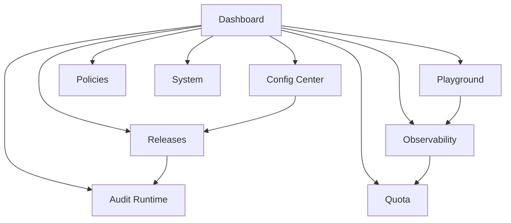
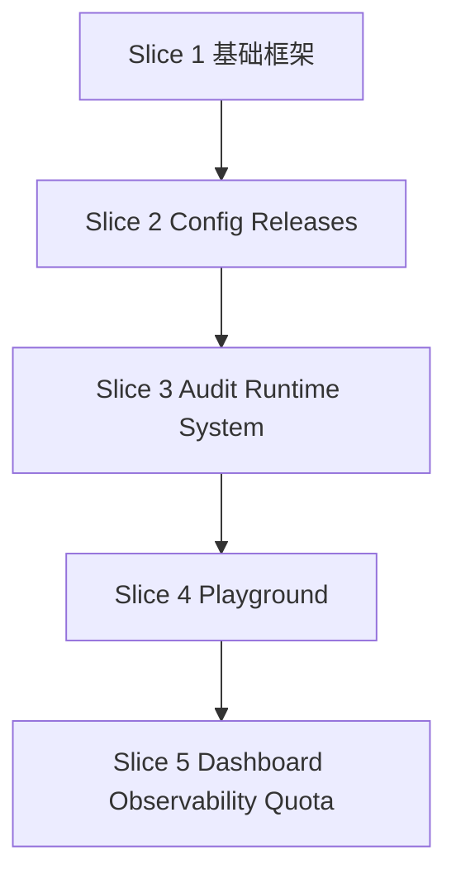

# 2026-03-25-llm-gateway-admin-console-and-playground-design

## 1. 背景与目标

当前项目已经具备可用的网关后端能力，包括 [`internal/httpserver/server.go`](internal/httpserver/server.go:47) 暴露的数据面接口、[`internal/httpserver/admin_handler.go`](internal/httpserver/admin_handler.go:1) 暴露的管理面接口，以及围绕 [`internal/controlplane/service.go`](internal/controlplane/service.go:1) 的配置版本生命周期能力。项目也已经通过全量构建、测试与多组验证脚本，具备继续向 Web 控制台演进的稳定基础。

第一期前端目标明确为：构建一个可直接通过浏览器访问的 **Admin 控制台 + 在线请求测试台**，并与现有 Go 服务同仓、同进程、同源部署。前端应优先满足管理员的运维、发布、排障、验证需求，同时提供可直接调用 `POST /v1/chat/completions` 的在线测试界面。

## 2. 设计原则

### 2.1 同进程内嵌部署
前端静态资源与 [`cmd/server/main.go`](cmd/server/main.go:1) 同时发布，由 Go 服务统一托管，避免第一期引入跨域、独立部署、反向代理编排和多环境静态托管复杂度。

### 2.2 管理台优先
第一期不做营销站、官网首页或对外开放页面，直接围绕管理员控制面和工程调试场景展开。

### 2.3 完整响应式可操作
虽然桌面端是主要使用场景，但第一期仍需保证平板与手机可操作，而不是仅可读。布局上采取桌面多栏、平板折叠、手机单列堆叠策略。

### 2.4 复用现有 API
前端优先适配现有 [`/admin/*`](internal/httpserver/admin_handler.go:99) 与数据面接口，仅在确有必要时新增极少量只读聚合接口。

## 3. 总体架构

### 3.1 部署形态
建议后续实施时采用以下结构：

- `web/admin/`：前端源码目录
- `web/admin/dist/`：前端构建产物
- `internal/httpserver/adminui/`：Go 侧静态资源入口与挂载逻辑
- [`cmd/server/main.go`](cmd/server/main.go:1)：统一提供 API 与 Web UI

### 3.2 请求关系
前端页面通过同源方式访问：

- 数据面接口：由 [`internal/httpserver/server.go`](internal/httpserver/server.go:47) 提供
- 控制面与管理接口：由 [`internal/httpserver/admin_handler.go`](internal/httpserver/admin_handler.go:1) 提供

### 3.3 前后端边界
前端负责：
- 页面结构
- 表单输入与预校验
- 列表筛选
- 结果展示
- 在线调试体验
- 交互反馈与状态缓存

后端负责：
- 业务逻辑
- 鉴权
- 配置生命周期
- 审计与运行时事件
- 聚合查询
- 静态资源托管

## 4. 信息架构

建议采用左侧导航控制台结构，一级导航如下：

1. Dashboard
2. Config Center
3. Releases
4. Audit & Runtime
5. Playground
6. Observability
7. Quota
8. Policies
9. System

## 5. 页面设计

### 5.1 Dashboard
首页展示最关键状态卡片与最近事件，帮助管理员快速判断系统是否健康、最近发生了什么、当前环境是否存在发布或推广动作、provider 或 quota 是否异常。

建议包含：
- 当前环境配置摘要
- 最近版本变更
- 最近 release 与 promotion 事件
- 最近 runtime publish 事件
- cache/provider/quota 摘要
- 异常热点提示

### 5.2 Config Center
面向配置版本查询与草稿创建，主要适配：
- `GET /admin/config-versions`
- `GET /admin/config-versions/{versionID}`
- `POST /admin/inheritance-drafts`

页面采用“列表 + 详情抽屉 + 创建表单”模式。

建议支持筛选：
- module
- tenant_id
- environment
- scope
- project_id

详情面板显示：
- version id
- status
- source metadata
- payload
- environment
- scope / project 信息
- actor / reason

### 5.3 Releases
面向显式发布与跨环境推广，主要适配：
- `POST /admin/releases`
- `POST /admin/promotions`

该页建议做成工作台：
- 左列输入目标对象与表单字段
- 中列展示 source / target、版本状态与风险提示
- 右列展示结果回执、生成的新版本 id、audit/runtime 回执

### 5.4 Audit & Runtime
主要适配：
- `GET /admin/audit-events`
- `GET /admin/runtime-events`

建议做成双标签页，并支持：
- tenant_id 过滤
- environment 过滤
- limit
- summary 视图切换

页面用途是排障与追踪控制面变更。

### 5.5 Playground
该页是第一期前端的核心亮点，用于在线调试网关行为，直接调用数据面 `POST /v1/chat/completions`。

页面建议采用左右双栏：

左侧请求编辑器：
- model
- tenant_id
- task hint
- messages 编辑器
- JSON Raw 模式切换
- 可选 headers
- 发送与保存模板按钮

右侧结果区：
- 响应内容
- 状态码
- 延迟
- 响应头
- cache 命中信息
- semantic score
- provider/model 决策信息
- 错误详情

辅助能力：
- 一键填充示例请求
- 最近请求模板
- 一键重放
- 复制 curl

### 5.6 Observability
主要适配：
- `GET /admin/observability/summary`
- `GET /admin/observability/cache`
- `GET /admin/observability/providers`
- `GET /admin/observability/hotspots`

建议以卡片总览 + 表格 + 趋势区形式呈现：
- 请求总量
- cache hit rate
- provider error rate
- 热点租户 / 模型
- provider 维度表格
- 热点请求列表

### 5.7 Quota
主要适配：
- `GET /admin/observability/quota`
- `GET /admin/observability/quota/trends`

重点展示：
- 当前 tenant quota 使用
- 时间窗口趋势
- top consumers
- 接近限制预警

### 5.8 Policies
第一期建议偏只读展示，主要适配：
- `GET /admin/policies/models`

后续再逐步增强策略编辑能力。

### 5.9 System
聚合：
- `GET /admin/health`
- `GET /admin/usage`
- `GET /admin/audit`

用于查看服务状态和基础系统信息。

## 6. 统一交互模型

建议全系统统一使用以下交互模式：

### 6.1 列表 + 筛选 + 详情抽屉
适用于版本列表、事件流、热点列表、quota 列表。

### 6.2 主表单 + 结果回执
适用于 draft、release、promotion 与 Playground 请求发送。

### 6.3 卡片总览 + 下钻
适用于 Dashboard、Observability、Quota。

### 6.4 时间线 / 事件流
适用于发布历史、审计历史、运行时变更历史。

## 7. 鉴权方案

### 7.1 设计原则
第一期前端不引入新的用户体系，而是直接复用现有管理面 Bearer token 模型。

### 7.2 登录方式
前端提供极简登录页：
- 输入 Admin Token
- 将 token 存入 session storage
- 所有 [`/admin/*`](internal/httpserver/admin_handler.go:99) 请求自动附带 `Authorization: Bearer <token>`

### 7.3 Playground 访问策略
第一期默认由已登录管理员直接使用 Playground。Playground 请求允许附加调试头，但不扩展为完整的多用户凭据系统。

### 7.4 鉴权错误处理
后端若返回 `401` 或 `403`：
- 清理本地 token
- 返回登录页
- 显示明确的错误提示

## 8. 技术选型

### 8.1 推荐前端栈
- React
- TypeScript
- Vite
- Tailwind CSS
- TanStack Query

### 8.2 选型理由
该组合适合：
- 构建后台控制台
- 做响应式布局
- 支持复杂表单与列表
- 打包静态产物简单，便于嵌入 Go 服务

### 8.3 图表与表单
建议选择轻量图表方案与 schema 驱动表单校验方案，以保证趋势图、Quota 看板、Playground 表单与发布工作台的开发效率。

## 9. 后端适配建议

虽然前端可以直接适配现有接口，但建议允许少量新增只读聚合接口，以降低前端并发请求与页面拼装复杂度，例如：

- Dashboard summary 聚合接口
- Playground 响应元信息聚合接口
- 版本详情扩展视图接口

新增接口应遵循“少量、只读、可选”的原则，不改变当前控制面主流程。

## 10. 错误处理策略

前端统一处理四类错误：

### 10.1 鉴权错误
包括 token 缺失、格式错误、无效。统一跳转登录页。

### 10.2 表单错误
包括必填缺失、source/target 相同、非法 limit、空白字符串等。优先前端预校验，后端保留最终校验。

### 10.3 业务错误
如 source 无 released 版本、draft 不存在、promotion 条件不满足。需要明确显示后端 message 与建议动作。

### 10.4 网络错误
包括服务未启动、超时、5xx。需要统一错误面板与重试操作。

## 11. 实施切片

建议按以下 5 个切片实施：

### Slice 1：基础框架
- 前端工程初始化
- 路由框架
- 布局系统
- 登录页
- 同进程静态资源集成
- 基础响应式骨架

### Slice 2：Config Center + Releases
- 版本列表
- 版本详情
- create draft
- release
- promotion
- 基础成功失败提示

### Slice 3：Audit Runtime + System
- audit events
- runtime events
- health / usage / audit 页面
- summary 切换
- 筛选与详情展示

### Slice 4：Playground
- 请求编辑器
- 响应展示
- header / cache / timing 解析
- 历史模板
- 复制 curl

### Slice 5：Dashboard + Observability + Quota
- 首页聚合看板
- summary 卡片
- 趋势图
- provider 表格
- quota 趋势

## 12. 最终建议

第一期应聚焦为：构建一个同进程发布、完整响应式、以 Admin 管控与在线请求调试为核心的 Web 控制台。

必须优先保障的四件事：
- 配置生命周期操作顺畅
- 事件与运行时查询清晰
- Playground 足够好用
- 首页能快速判断系统状态
